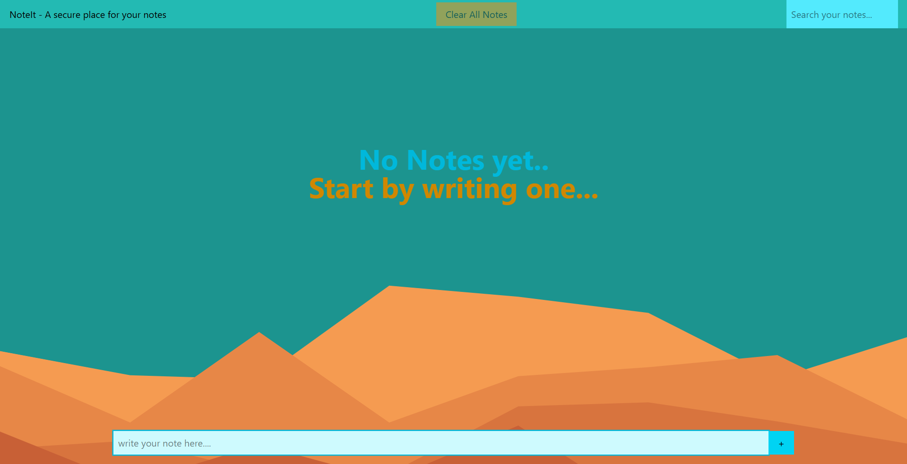
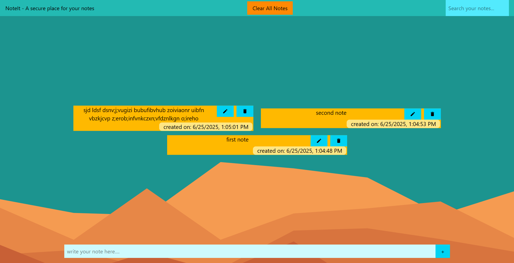
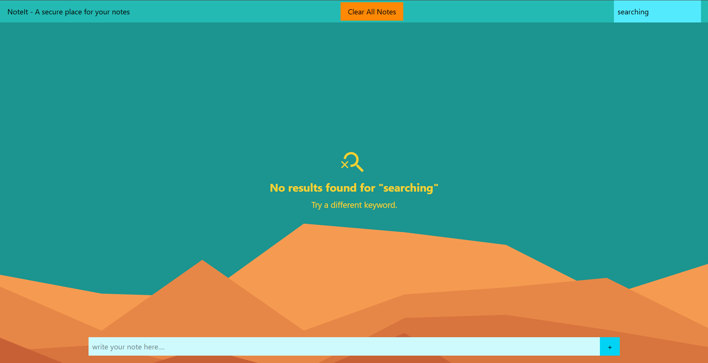

# 📝 NoteIt - A Secure Place for Your Notes

A simple and elegant note-taking app built with **React** and **Tailwind CSS**. It allows users to quickly jot down, search, edit, and delete notes with ease. Notes are stored locally using browser storage, so your data is safe and persistent — even after refreshing.

---

## ✨ Features

- ✅ Add, edit, and delete notes  
- 🔍 Real-time search with “no result found” message  
- 💾 Persistent localStorage support  
- 🎯 Auto-focus input on edit mode  
- 🧹 Clear all notes with confirmation prompt  
- 📱 Fully responsive and user-friendly UI  

---

## 📸 Screenshots

### Home (No Notes)


### Notes Display


### Search - No Results


---

## ⚙️ Tech Stack

- [React](https://reactjs.org/)  
- [Tailwind CSS](https://tailwindcss.com/)  
- [Vite](https://vitejs.dev/)  
- [UUID](https://www.npmjs.com/package/uuid)  
- HTML5, JavaScript (ES6+)

---

## 🚀 Getting Started

```bash
# Clone the repository
git clone https://github.com/Vermadeepakd1/NotesApp.git
cd notesapp

# Install dependencies
npm install

# Run the development server
npm run dev
```

## 🗂️ Folder Structure

/src   
  |── components   
  │   ├── NoteApp.jsx      
  │   ├── Note.jsx  
  │   ├── NoteInput.jsx   
  │   ├── Navbar.jsx  
  │   └── FilteredContent.jsx   
  ├── App.css   
  └── main.jsx

  ---

## 📄 How It Works

- Notes are added with a timestamp and unique ID.
- All data is saved in localStorage, automatically synced on every change.
- Notes can be edited inline, and editing triggers an auto-focus for smooth UX.
- A custom search bar filters notes based on the content you type. 
- A "Clear All Notes" button allows wiping all data with confirmation.

---

## 🛠 Improvements in Future

- ✅ Animations (explored during development)
- 🧠 Categories/labels for notes
- 🔐 Auth + sync with Firebase or Supabase
- 📅 Sort/filter notes by date

---

## 🤝 Contributing

Contributions are welcome! Here's how you can help:

1. Fork the repository  
2. Create a new branch (`git checkout -b feature-xyz`)  
3. Make your changes  
4. Commit and push (`git commit -m "Added feature xyz" && git push`)  
5. Create a pull request  

---

## 📜 License

This is an open-source project — feel free to explore, use, and improve it!

---

> Made with ❤️ by **Deepak Verma**


